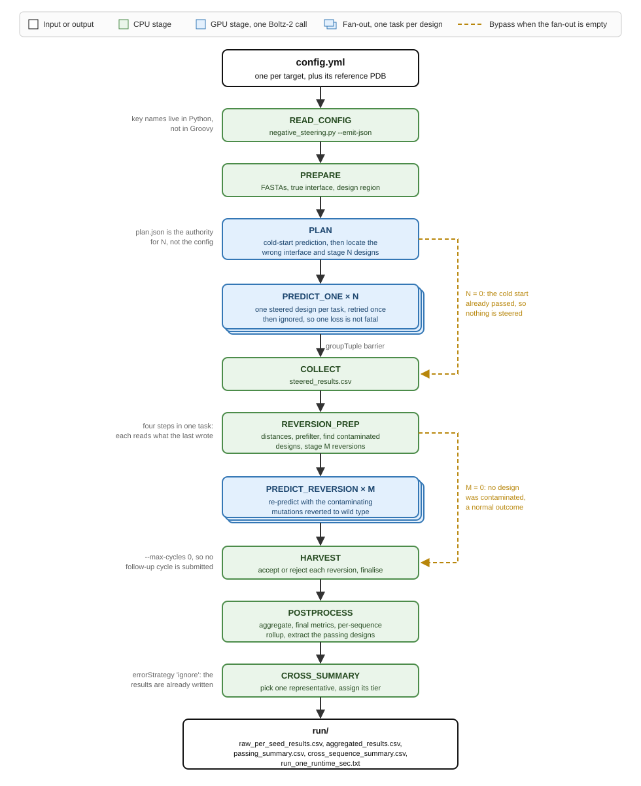

# Structure Negative Steering

[](https://github.com/joshuandwilliams/structure-negative-steering/actions/workflows/test.yml)
[](https://github.com/joshuandwilliams/structure-negative-steering/actions/workflows/lint.yml)
    

A standalone home for the Boltz-2 negative-steering engine, so it can be run and tested on arbitrary inputs in isolation. Negative steering mutates the receptor surface residues that a prediction wrongly places in contact with the effector, so the model can no longer settle there and has to find the real interface instead.

`bin/` and `modules/` originate from [`receptor-resurfacing-pipeline`](https://github.com/joshuandwilliams/receptor-resurfacing-pipeline) and have since diverged. They are this repo's code now. It benchmarks them against 18 solved NLR integrated-HMA-domain and MAX-effector complexes.

## Status

The benchmark is complete, the committed analyses are current, and the test suite passes.

Coverage over `bin/` is 64% and gated as a ratchet that may only rise. `scripts/` is at 98%. The remaining gap is concentrated in the multi-cycle loop of `boltz2_iterate_steering` and the reversion harvest in `reversion`, which need a GPU and the Boltz image. The smoke run (below) is how those are reached.

CI runs on every push and pull request. `lint.yml` is ruff, pinned to the version in `environment.yml` so it applies the same rule set as a local run. `test.yml` runs the two local test tiers, then stub-runs the workflow to check the DAG still wires up. The `hpc` tier is not run there, since it needs a GPU, the Boltz image or a finished run.

The committed results were produced by the previous single-job runner, not by the Nextflow workflow that replaced it. The stage sequence and every scientific parameter are unchanged, so a re-run reproduces them, but they have not been re-run.

## How it runs



One target is one `config.yml`. The two fan-outs, one Boltz-2 call per steered design and one per reverted design, were bash loops inside a single SLURM job. They are Nextflow channels now, so each prediction is a task with its own resources, retry and failure. The width of each fan-out is read from the stage that precedes it rather than from the config, because the plan legitimately stages fewer designs than asked, or none at all when the cold start already passes.

Each stage appends its elapsed seconds to `run/.stage_times`, and `POSTPROCESS` sums them into `run_one_runtime_sec.txt`. That is the per-run cost the compute-cost analysis reads. It is a sum rather than a wall-clock, because the single job it replaced ran the stages in sequence, and the sum is what stays comparable with the committed benchmark.

## Design decisions

**`bin/` and `modules/` are owned here.** They started as a copy of the pipeline's negative-steering entry points and their import closure. They have since diverged and are no longer kept in step with it. Changes made here do not flow back to the pipeline, and pipeline changes do not flow in.

**Follow-up cycles are structurally absent, not just switched off.** `boltz2_iterate_steering.py` can submit its own next cycle with `sbatch`. This repo always ran it at `--max-cycles 0`, so that never fired here. The workflow keeps that setting and adds no path back to it. Re-enabling cycles means wiring them as channels in `main.nf`, not letting Python call the scheduler from inside a task.

**Every process declares a `path` output, including the ones whose result is a value.** Nextflow hashes file content to decide what `-resume` may skip. A process that emits only `val` gives it nothing to hash, and a resumed run silently repeats hours of GPU work. Each stage therefore copies its artefact into the task directory and declares it.

**A run resumes rather than restarting.** `cmd_predict_one` skips a design whose prediction already exists, so a job that hits the SLURM walltime mid-sweep can be resubmitted without discarding completed work. The full experimental complexes here run up to ~1400 residues, which the pipeline's short design fragments never do. The guard confirms the on-disk `prediction.pdb` receptor sequence still matches the design's `receptor.fasta` before skipping, and recomputes on any mismatch, so it cannot reuse a stale prediction. Design sampling is seeded and design directories are created with `exist_ok=True`, so a re-run reproduces the same designs.

**The design region is protected, not targeted.** Negative steering does not mutate the interface to break binding. It mutates surface residues the *predicted* structure wrongly places in contact, excluding a protected set that includes the design region. In the full pipeline that region is the RFDiffusion de-novo stretch being validated, which must stay untouched so the rescue pose is not contaminated.

**A native solved complex is a sanity case, not the normal input.** It has no de-novo region, so the default is `design_region: none` with `negsteer_protected_set_source: true_interface`. A native complex already binds at its true interface, so the predicted wrong interface overlaps the true one heavily. The engine detects this almost-already-correct regime, gentles the mutation count, and leans on its second-shell fallback of residues near but not at the protected interface. To steer a designed sequence instead, point `reference_pdb` at the design and set `design_region` to the de-novo stretch with `negsteer_protected_set_source: design_region_union`.

**Reference restraints are a ceiling, not a method.** `negsteer_boltz_constraints: true` appends the same Cα pocket and dense-contact block as `structure-prediction-benchmarking`'s `BOLTZ2_CONSTRAINED` process to every Boltz-2 call in the run. Those restraints are derived from the true interface, so they cannot run on a novel target. They show the failures are not intrinsic to Boltz-2.

**The representative design is picked by reliability first, then median.** `make_plots.select_representative` ranks by how many seeds cleanly pass, so 3/3 beats 2/3 beats 1/3 regardless of median. It breaks ties on the median `ra_eff` of those seeds, computed on each seed's reversion-corrected final value rather than its raw pre-reversion prediction. This is deliberately not `cross_sequence_summary.csv`'s own `rep_ra_eff_vs_truth_median`, which is a composite selection that also weighs interface Jaccard overlap. The two mostly agree and occasionally differ.

**Per-run cost is set by `negsteer_n_designs`, per-prediction cost is not.** Benchmark wall-clock uses `standalone_elapsed_s`, not `elapsed_s`, so the shared ColabFold MSA search is charged to the models that depend on it. Using `elapsed_s` understates Boltz-1 MSA, Boltz-2 MSA and ColabFold by roughly 35 min each and inverts the per-prediction conclusion.

**`make_plots.py` calls `matplotlib.use("Agg")` at import.** That is correct for a headless script and wrong inside a notebook kernel, where it silently stops figures reaching the HTML. `confidence_common.restore_inline_backend` wraps the import. Do not drop it. Assign the figure helpers' return value (`_ = cc.fig_...`) or each figure is emitted twice.

## The benchmark

18 targets, each an isolated integrated HMA decoy domain (Pikp, Pikm, RGA5-HMA) bound to an AVR effector, every one receptor = chain A and effector = chain B. They are the same 18 that `structure-prediction-benchmarking` covers in its Tier-1 comparison.

Each target runs twice, once under `unconstrained/` and once under `constrained/`. The unconstrained run is negative steering alone. The constrained run is the same config with `negsteer_boltz_constraints: true`, so every Boltz-2 call also carries the benchmark-style pocket and contact restraints.

| Target | | | | | |
|---|---|---|---|---|---|
| 5A6W | 5ZNG | 6FU9 | 6FUB | 6FUD | 6G10 |
| 6G11 | 6Q76 | 6R8K | 6R8M | 7A8W | 7A8X |
| 7BNT | 7QPX | 7QZD | 8B2R | 9IMU | 9IP6 |

```
experiments/benchmarking/
├── unconstrained/<TARGET>/
└── constrained/<TARGET>/
        ├── config.yml, <TARGET>.pdb    tracked test spec
        ├── negsteer_<jobid>.out/.err   SLURM logs
        ├── inputs/                     derived by prepare
        └── run/                        engine workdir + launch.sh
```

Only `config.yml` and the reference `<TARGET>.pdb` are tracked. Everything generated stays inside its own target folder and is gitignored. Every config is identical to `unconstrained/6G10/config.yml` apart from `name`, `reference_pdb` and the constraints toggle. Add a target by copying an existing folder, dropping in its PDB, and editing those fields.

## Results

18 / 18 targets produced a representative steered design. Representative `ra_eff` runs from 0.91 Å to 29.64 Å with a median of 3.40 Å, and 12 / 18 reach the ≤ 5 Å pass threshold. Steering improved the pose for 13 targets and worsened it for 4. On the rescue matrix that is 8 rescued, 4 already correct, 6 still incorrect and 0 lost, so steering never turns a correct cold start incorrect. Among the 12 passing targets, 5 pass on 3/3 seeds, 6 on 2/3 and 1 on 1/3.

The four-way method comparison passes 9 / 18 unrestrained, 12 / 18 with negative steering alone, 14 / 18 with reference restraints alone, and 18 / 18 with both. The combined lever clears all six targets steering alone misses (5A6W, 6FUB, 7A8X, 7BNT, 7QPX, 7QZD), including the three neither lever solves by itself.

**On confidence, the safe claim is the null, stated on ipTM.** ipTM is unmoved by steering. The benchmark also shows a small pLDDT cost that scales with mutation budget, median Δ complex pLDDT −3.24 and Δ interface pLDDT −5.96, both at p = 0.001 over the 15 steered targets. That cost is specific to this benchmark and is paid by rescued and still-wrong targets alike, which points at sequence perturbation rather than at a worse interface. It does not replicate on a larger sample, so it should not be quoted on its own as a cost of steering. See `analysis/06-confidence-synthesis/` for the qualifying data.

## What it measures

**Pose accuracy** is `ra_eff`, receptor-aligned effector RMSD in Å. Lower is better, and ≤ 5 Å counts as a correct pose. Two predictions are compared against the experimental truth. The **cold start** is the initial Boltz-2 prediction before steering, from `run/cycle_0/plan.json::initial_receptor_aligned_effector_rmsd`. The **representative** is the steered design selected as described under Design decisions.

**Confidence** is complex pLDDT, interface pLDDT and ipTM. pLDDT is rescaled to 0–100 on load, since a drop of 0.032 is easy to misread and 3.2 pLDDT points is not. Interface pLDDT is measured over whichever residues the prediction actually contacts, so before and after cover partly different residue sets when the pose moves. Complex pLDDT is reported alongside for that reason.

**The cold start is a genuine paired baseline.** It is the `initial` row of the engine's own `raw_per_seed_results.csv`, predicted by the same engine with the same recycling, diffusion and template settings as every steered design.

**Tiering.** The last stage runs `cross_summary_cli.py` on `passing_summary.csv` and writes `run/cross_sequence_summary.csv`. Each run yields one tiered representative.

| Tier | Condition | Meaning |
|:---|:---|:---|
| A | `n_pass == n_seeds` | all seeds pass |
| B | `1 < n_pass < n_seeds` | most seeds pass |
| C | `n_pass == 1` | one seed passes |
| none | `n_pass == 0` | no passing seed |

With `num_seeds: 1` only A or none can occur. `num_seeds >= 3` is what lets A/B/C resolve.

## Using it as a tool

`negsteer` is the interface another pipeline calls, in the same way it calls RFDiffusion or ProteinMPNN. One command, one run directory.

```bash
singularity exec --nv negsteer.img negsteer run \
    --name            design_00 \
    --receptor-fasta  receptor.fasta \
    --effector-fasta  effector.fasta \
    --reference-pdb   complex.pdb \
    --design-region   design_region.txt \
    --true-interface  true_interface.txt \
    --outdir          design_00
```

Everything else has a default. `--n-designs`, `--num-seeds`, `--diffusion-samples`, `--recycling-steps` and `--boltz-constraints` cover the usual knobs, and `--plan-extra-args` forwards anything else to the engine verbatim so the CLI never becomes a bottleneck. A knob you do not set is not forwarded, so the engine's own default applies rather than this CLI restating it.

**Read `negsteer_result.json`, do not glob the directory.** It names every output, reports whether each one exists, and carries a `contract_version` to pin against. Files not named in it are internals and may move.

```json
{
  "contract_version": 1,
  "name": "design_00",
  "status": "ok",
  "skip_steering": false,
  "n_designs_planned": 20,
  "n_reversions_planned": 3,
  "tiering_succeeded": true,
  "runtime_seconds": 6690,
  "outputs": {
    "per_seed_results": "raw_per_seed_results.csv",
    "aggregated_results": "aggregated_results.csv",
    "passing_summary": "passing_summary.csv",
    "cross_sequence_summary": "cross_sequence_summary.csv",
    "runtime_seconds": "run_one_runtime_sec.txt"
  }
}
```

`status` is `skipped_steering` when the cold start already passed, which is a normal outcome and not a failure. `tiering_succeeded: false` means the run produced its results but the representative could not be picked, which is also not a failure.

`integration/negative_steering.nf` is a drop-in Nextflow module for `receptor-resurfacing-pipeline`, replacing the copy of the engine it carries today.

The CLI runs the same nine stages, in the same order, with the same arguments as `bin/negative_steering_run_one.sh`, which produced the committed benchmark. That equivalence is asserted by `tests/characterization/test_negsteer_cli.py`, so the tool and the runner behind the published numbers cannot drift apart.

Nesting is not a problem: the engine detects `SINGULARITY_NAME` and calls `boltz` directly when already inside a container, which is why `negsteer` can run in-container while the old shell orchestrator could not. `--boltz-container` is only needed on a bare host.

Until the image is rebuilt from `containers/boltz2_negsteer.def`, reach the same CLI from a bind-mounted checkout:

```bash
singularity exec --nv --bind $REPO negsteer.img \
    env PYTHONPATH=$REPO python -m negsteer.cli run ...
```

## Running it

The engine is a mid-pipeline component. It does not turn a bare PDB into results by itself. It needs both chain sequences plus a true-interface and a design-region index file, and it uses the complex as the comparison basis. Runs are config-driven, one YAML per target.

The HPC is airgapped, so nothing is installed there and everything runs in a container. `negative_steering.slurm.sh` uses only `bash`, `grep` and `singularity` on the host. All Python runs inside the Boltz image, which ships `yaml`, `gemmi`, `biopython` and `numpy`. The GPU allocation is required or Boltz fails with "No supported gpu backend found!".

`main.nf` is the entry point. It takes a glob, so one target and the whole benchmark are the same command. Nextflow submits each stage to SLURM itself, so run it from the login node rather than under `sbatch`.

```bash
./scripts/sync_to_hpc.sh                       # from the Mac. Excludes experiments/ and analysis/

# on the HPC:
export NXF_LOG_FILE=.nextflow-reports/nextflow.log     # keeps the repo root clean
nextflow run main.nf --targets 'experiments/benchmarking/**/config.yml'
nextflow run main.nf --targets experiments/benchmarking/unconstrained/6G10/config.yml
nextflow run main.nf --targets tests/smoke/config.yml

nextflow run main.nf --targets '...' -resume     # skip what already finished
nextflow run main.nf --targets '...' -stub-run   # walk the DAG with no Boltz calls
```

Every run artefact lands in `.nextflow-reports/`: the trace the compute-cost analysis reads, the HTML report and timeline, and the log. The config places the first three. The log is chosen before the config is read, so it needs `NXF_LOG_FILE` as above, or `nextflow -log .nextflow-reports/nextflow.log run ...` per invocation. Without either, Nextflow drops `.nextflow.log` in whatever directory you launched from. `.nextflow/` is Nextflow's own state directory and cannot be moved; it is hidden and gitignored.

`-stub-run` checks the wiring on a laptop in seconds, with no container and no GPU. Every stage has a stub that writes a plausible artefact, so the channel shapes, the two fan-outs and both empty-fan-out bypasses are all exercised.

The trace, report and timeline are written on every run. `trace.txt` is what the compute-cost analysis reads.

A single target can still be run without Nextflow, which is useful when debugging one config. This is the runner that produced the committed results.

```bash
sbatch scripts/negative_steering.slurm.sh experiments/benchmarking/unconstrained/6G10/config.yml

# CPU-only steps need no GPU node. Run them interactively with bash:
bash scripts/negative_steering.slurm.sh experiments/benchmarking/unconstrained/6G10/config.yml --dry-run
bash scripts/negative_steering.slurm.sh experiments/benchmarking/unconstrained/6G10/config.yml --prepare-only
```

`scripts/submit_benchmarks.sh` wraps that runner for the whole benchmark, one `sbatch` per target. It directs the SLURM `.out`/`.err`, the derived `inputs/` and the `run/` workdir into each target's own folder, so nothing floats in the repo root. A bare `sbatch` writes its logs to the submission directory instead.

```bash
./scripts/submit_benchmarks.sh --dry-run                 # preview the sbatch commands
./scripts/submit_benchmarks.sh                           # everything outstanding
./scripts/submit_benchmarks.sh --variant constrained     # one variant
./scripts/submit_benchmarks.sh --only 6G10               # one target, both variants
./scripts/submit_benchmarks.sh --only constrained/6G10   # one target, one variant
```

On the Mac the Python driver runs the CPU-only steps directly, for prepping and inspecting.

```bash
pip install -e '.[experiments]'                 # numpy, pandas, scipy, gemmi, biopython, matplotlib, pyyaml
./scripts/negative_steering.py experiments/benchmarking/unconstrained/6G10/config.yml --dry-run
./scripts/negative_steering.py experiments/benchmarking/unconstrained/6G10/config.yml --prepare-only
```

The run splits across the container boundary. `negative_steering.py` runs inside the Boltz image, because that is where Python lives. It parses the config, calls `prepare_complex_inputs.py` to derive the FASTAs, interface and design region, then writes `run/launch.sh` with every engine argument already resolved. `negative_steering.slurm.sh` executes that on the host, because the engine orchestrator does its own `singularity exec --nv` and singularity cannot be nested. It then assigns the run's tier. `launch.sh` doubles as the record of exactly what ran.

The container defaults to the config's `boltz_container:`. Override it with `--container /path/to.img`, and see `/hpc-home/jowillia/singularity/` for the library.

### Driving the two steps by hand

The config driver is the supported path. `prepare_complex_inputs.py` also runs on its own, for deriving inputs for something that has no `config.yml`.

```bash
./scripts/prepare_complex_inputs.py \
    --complex experiments/6G10/6G10.pdb \
    --outdir  experiments/6G10/inputs \
    --derive --contact-cutoff 5.0
```

Prepare writes `receptor.fasta`, `effector.fasta`, `true_interface.txt` and `design_region.txt`. For 6G10 that is receptor chain A at 76 residues, effector chain B at 83, and 26 interface residues at 5 Å.

The interface is either derived from heavy-atom contacts with `--derive --contact-cutoff`, or supplied with `--interface-file`. Chains default to receptor A and effector B, overridden with `--receptor-chain` and `--effector-chain`. The design region takes `--design-region none|all` or `--design-region-file FILE`.

**The two residue files use different index bases.** `--interface-file` takes 0-based positional indices, one per line or comma-separated, with `#` comments ignored. `--design-region-file` takes a 1-based list.

## Repo layout

```
main.nf       The workflow. Wiring only, one line per stage
modules/      negsteer_stages.nf, one process per stage
nextflow.config  Resources per label, retry policy, trace and report
bin/          The engine. Entry points and their import closure
containers/   Singularity definition files. The images live on the cluster
scripts/      negative_steering.{py,slurm.sh} run one config without Nextflow,
              submit_benchmarks.sh wraps them, sync_{to,from}_hpc.sh move data
docs/         The workflow figure
experiments/  Gitignored and HPC-authoritative, except benchmarking/'s test specs
analysis/     One folder per analysis, each with its own thesis-figures/ and
              supplementary-figures/
tests/        Three tiers under characterization/, plus the SLURM wrappers
```

`experiments/` is HPC-authoritative and never pushed up by `sync_to_hpc.sh`, so a code sync can never overwrite or delete results. The exception is `experiments/benchmarking/*/config.yml` and `*.pdb`, which are tracked because they are the reproducible test spec.

## Analyses

One numbered folder per document, each named after the document it holds. A folder carries its `.qmd`, its rendered `.html`, its own `thesis-figures/` and `supplementary-figures/`, and the data and scripts it owns, so a figure's provenance is its directory. Where a document reads something another one owns, it names that folder explicitly rather than duplicating the file. Rendered HTML and the `*_files/` bundles are gitignored build artefacts. Quarto sets the working directory to the rendering document's folder, which is what puts figures in the right place.

| Document | Asks | Data |
|:---|:---|:---|
| `01-pose-rescue` | does steering rescue the pose | 18 benchmark targets |
| `02-model-choice` | steering against reference restraints | 18 targets, four variants |
| `03-compute-cost` | what a steering run costs to run | 18 targets |
| `04-confidence-cost` | does steering cost confidence | 18 targets, 828 predictions |

`05-campaign-confidence`, `06-confidence-synthesis` and `07-ipsae-instability` draw on a cohort outside this repo. Their scope is under review and they are not described here.

### Reproducing

Run outputs live on the HPC and are gitignored. Pull the lightweight summaries down, roughly 16 MB with no raw model outputs, then regenerate.

```bash
scripts/sync_from_hpc.sh --list                              # what is on the HPC
scripts/sync_from_hpc.sh --name benchmarking --results-only  # summaries only
python3 analysis/01-pose-rescue/make_plots.py                 # benchmark_summary.csv + figures
python3 analysis/03-compute-cost/stage_runtime_comparison.py  # runtime_comparison.csv
cd analysis/01-pose-rescue && quarto render 01-pose-rescue.qmd
```

`make_plots.py` takes `--bench` and `--outdir` to override the input tree and output location. Every analysis falls back to its committed cached table when the source tree is absent, so all of them re-render anywhere.

Two staged inputs come from outside this repo. `boltz2_benchmark_comparison.csv` holds unconstrained and reference-restrained Boltz-2 `ra_eff` per target, from `structure-prediction-benchmarking`'s `combined_metrics.csv`. `negsteer_maxrss.csv` holds peak memory from Slurm accounting, collected on the cluster by `collect_negsteer_maxrss.sh` and copied back. That script globs the cluster's own `experiments/benchmarking/`, so it re-emits any target still present there.

### Known limits

The dose axis is not a controlled titration. Only two budgets are well populated, 3 and 6 mutations, and budget is constant within a target. It is always a between-target contrast, so a within-target budget sweep would settle it.

The benchmark generates 20 candidate steered designs per target, so the representative is the best of 20. Any comparison against a cohort run at a different depth carries that difference.

Pooling per-target medians gives each target one vote regardless of how many predictions it contributed. Absence of a difference is not evidence of equivalence. These tests can exclude an effect the size of the observed pLDDT drop, not an arbitrarily small one.

## Tests

936 tests across three tiers, one marker each.

| Tier | Where it runs | Covers |
|:---|:---|:---|
| `local_unit` | anywhere with Python | pure helpers on synthetic input |
| `local_integration` | Mac, no cluster | the committed fixtures and references |
| `hpc` | needs a finished run or a GPU | a run tree, or a fresh engine run on the cluster |

```bash
mamba env create -f environment.yml && mamba activate negsteer-analysis
pytest -m local_unit                          # fastest
pytest -m "local_unit or local_integration"   # everything that needs no run
pytest                                        # adds the hpc tier
sbatch tests/run_pytest.slurm.sh -m hpc       # against a run already on disk
sbatch tests/run_smoke_negative_steering.slurm.sh   # produce a fresh run, then assert
```

### The smoke run

`tests/run_smoke_negative_steering.slurm.sh` runs the engine end to end on a GPU
node and then asserts on what it produced. This is the only test that reaches
the plan and collect stages of `boltz2_negative_steering`, the per-cycle loop in
`boltz2_iterate_steering`, and the contamination and reversion harvest in
`reversion`. None of those can run without the Boltz image.

`tests/smoke/config.yml` is 6Q76 with every cost knob at its floor, one design
by one seed by one diffusion sample. 6Q76 was chosen because it is the smallest
complex whose cold start fails, at 7.4 Å against the 5 Å threshold, so the
steering path actually runs. The three smaller targets all pass at cold start
and would skip the half of the engine worth testing. That is roughly 3 Boltz
calls against the ~305 a benchmark target runs, so expect minutes.

It is not a benchmark configuration and its numbers must never be pooled with
`experiments/benchmarking/`.

The assertions deliberately do not check the pose. One design and one seed is
far too little sampling to expect a rescue, and asserting `ra_eff` improved
would make the test flaky for reasons unrelated to whether the engine works.
What is checked is that every stage ran and wrote what it promises, that the
counts match the config, and one real invariant: that steering never mutated a
residue in the protected true interface. Steering that mutated the binding site
would be destroying it rather than removing a competitor, and every downstream
number would still look plausible.

Validate the config on a laptop first, which needs no GPU:

```bash
./scripts/negative_steering.py tests/smoke/config.yml --prepare-only
```

Most of `bin/` is the same code the pipeline ships, so most of these tests came
from `receptor-resurfacing-pipeline/tests/characterization/`. Eleven files
ported without modification, because both repos put `bin/` at the repo root and
resolve it the same way. They cover `position_set`, `contig_spec`,
`stage_result`, `protein_structure_prediction`, `boltz_confidence`,
`design_cohort`, `designed_sequence`, `designed_backbone`, `cross_summary_model`,
`pipeline_thresholds` and `negative_steering_run`.

The `hpc` tier pins a finished benchmark run. It asserts both variants cover the
same targets, that every run carries the outputs it should, that one run yields
exactly one tiered representative, and that a run under `constrained/` really
did carry `--boltz-constraints`. That last one is the only thing that would
catch a run landing in the wrong variant directory, which would silently make
the comparison between them meaningless. The tier skips cleanly when no run tree
is present. Point it elsewhere with `NEGSTEER_BENCH_DIR`.

Two invariants worth naming, because both were wrong on the first attempt.
`summary.txt` is not written by every run, since a target whose cold start
already passed short-circuits before it. And `cross_tier` is assigned from
`passing_summary.csv`, so a tier-none row can still carry a non-zero
`rep_n_pass`. That block is filled by a best-of-a-bad-lot fallback from
`aggregated_results.csv` rather than by the passing gate.

The cross-summary chain is pinned by golden output. Four committed fixtures
reproduce real runs covering every tier, A, B, C and none, and the test asserts
every computed column matches, excluding only the two columns that record an
input path. The tier-none fixture carries the sibling `aggregated_results.csv`
the fallback reads, without which the representative block comes back empty
rather than failing.

`prepare_complex_inputs.py` is asserted against 6G10's known answer, receptor
chain A at 76 residues, effector B at 83, and 26 contacts at 5 Å.

The workflow itself is tested two ways. `-stub-run` walks the whole DAG with no
container and no GPU, which is what catches a broken channel shape. And
`tests/test_smoke.py` asserts that every process the module defines is included
by `main.nf`, and that the figure at the top of this file still shows exactly
those processes with the GPU stages coloured as GPU stages. A figure that has
drifted from the code is worse than no figure, because it is still believed.

Coverage runs on every invocation and is gated as a ratchet that may only rise.
`htmlcov/index.html` is the browsable report and `lcov.info` the machine-readable
one, both gitignored.

## Environment

`environment.yml` pins the conda environment the analyses render in and the
local tiers run in. It contains no structure predictor and no GPU stack. Those
live in the Singularity image built from `containers/boltz2_negsteer.def`.

`containers/` holds the definition files for the two images this repo needs.
`boltz2_negsteer.def` builds the engine runtime, Boltz-2 with its CUDA stack.
`pytest_runner.def` builds the image `tests/run_pytest.slurm.sh` runs the
cluster tier inside, so nothing is installed on the airgapped host.
